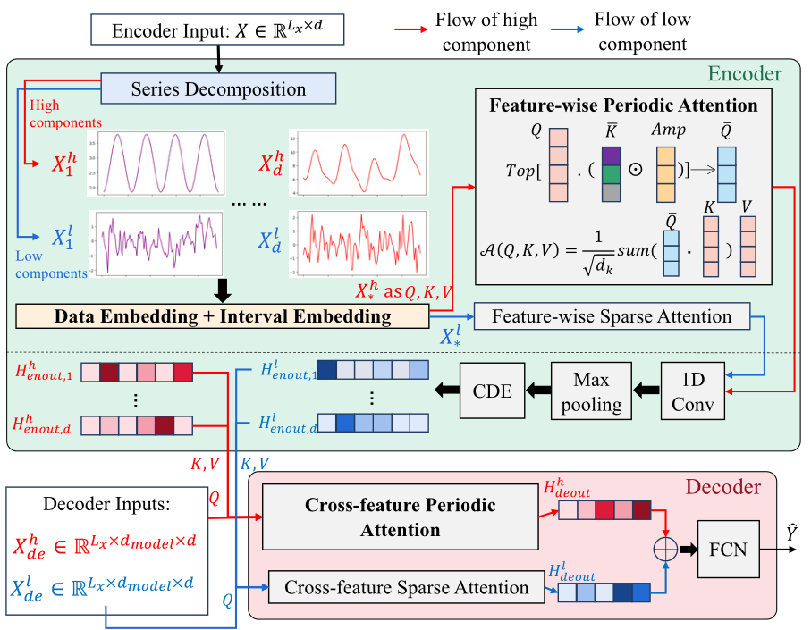

# Periormer: Periodic Transformer for seasonal and irregularly sampled time series

This repository contains the code and datasets for the paper "Periormer: Periodic Transformer for seasonal and irregularly sampled time series". In this paper, we propose a new method for time series prediction considering different periodic patterns under different sampling rate of the raw series.

We design Periormer structure to handle irregular sampling rate and periodic patterns. The overall architecture can be found on the following figure.

Also, the periodic attention and main results are shown in the following figure.

# Dataset:
For WTH, ETTh1, please refer to [here](https://github.com/zhouhaoyi/Informer2020) for detailed illustration.
For NDBC, please refer to [here](data/Environment/Methods%20to%20obtain%20NDBC%20datasets.txt) and [here](https://github.com/xren451/CDE-Periormer/blob/main/data/Environment/ndbc_web_data_guide%20(1).pdf) for detailed data retrieving method. Please use [here](data/Environment/read_NDBC.ipynb) for a easy way to obtain the NDBC dataset.
For stock, please refer to [here](https://github.com/microsoft/qlib/tree/main/scripts/data_collector/yahoo) to obtain the dataset.

# Running the experiment:

To run the experiment, please use "example.sh" to run prediction experiment for WTH dataset.

# Hyperparameter:

For all methods, the input length is chosen from 24, 48, 96, 192, 336 for all datasets, the batch size is set to 32, and the learning rate in Adam optimizer is set to 0.0001. For all datasets, we split the training, validation, and test set by the ratio of 6:2:2. We set the hyper-parameters for all baselines to the best values achieved in the validation set. For [Informer](https://github.com/zhouhaoyi/Informer2020), we set the number of attention heads ℎ to 16 and the stride in the max pooling to 2. For [Autoformer](https://github.com/thuml/Autoformer), the hyper-parameter 𝑐 of Autocorrelation is set to 2. The numbers of encoder layers and decoder layers are set to 2 and 1, respectively. For  [Reformer](https://github.com/lucidrains/reformer-pytorch),
the number of layers is set to 3. The embedding size is set to 1024 in [Reformer](https://github.com/lucidrains/reformer-pytorch) and 512 for the other approaches. 𝑅2 is set to 80% and
95% for the truncation of the high component and low component, respectively, in CDE-Periormer. All experiments are conducted in PyTorch on a single NVIDIA GeForce RTX 3060 Ti GPU.

# Reproductability:

For reproductability, please refer to [Results](/Results) folder.
